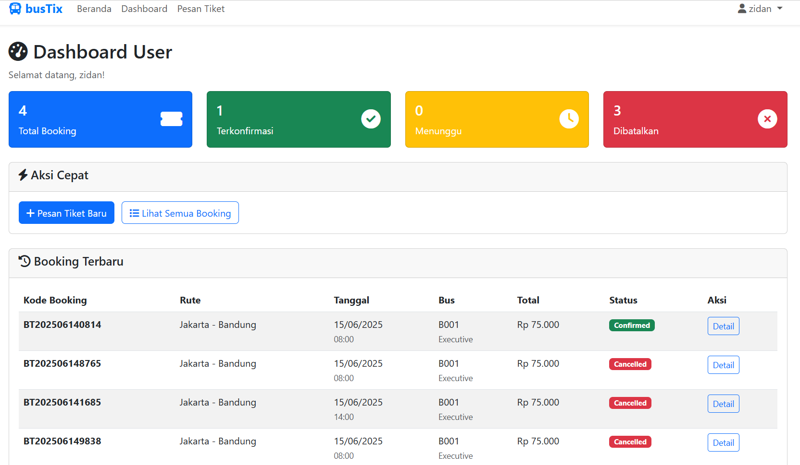
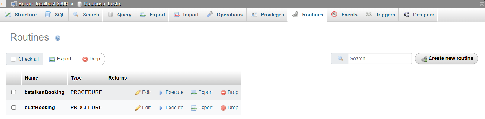
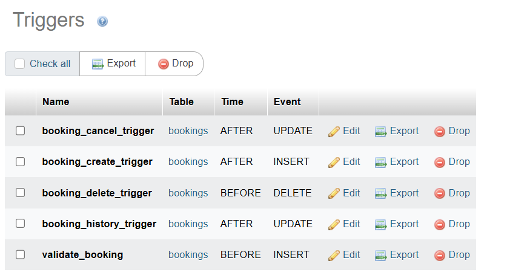

# 🚌 bustix-system (Sistem Pemesanan Tiket Bus)

Proyek ini merupakan sistem informasi pemesanan tiket bus berbasis PHP dan MySQL. Dirancang dengan pendekatan modular dan prinsip integritas data tinggi menggunakan **stored procedure**, **trigger**, **transaction**, dan **event scheduler** SQL. Cocok untuk skala UMKM transportasi dengan manajemen armada dan jadwal perjalanan.



---

## 📌 Detail Konsep

### ⚠️ Disclaimer

Peran dari **stored procedure**, **trigger**, **transaction**, dan **scheduler** pada proyek ini dikembangkan untuk memenuhi skenario sistem tiket bus. Implementasi bisa berbeda pada sistem lain tergantung skema bisnis yang diterapkan.

---

### 🧠 Stored Procedure

Procedure digunakan untuk mengelola proses pemesanan tiket, pembayaran, dan pembatalan secara langsung dari sisi database, menjamin konsistensi data.



Contoh: `buatBooking`

1. bayarBooking(p_booking_code)
Menandai status pembayaran booking menjadi paid dan mencatat histori pembayaran.

```sql
DELIMITER $$

DROP PROCEDURE IF EXISTS bayarBooking $$
CREATE PROCEDURE bayarBooking(
    IN p_booking_code VARCHAR(20)
)
BEGIN
    UPDATE bookings 
    SET payment_status = 'paid' 
    WHERE booking_code = p_booking_code;

    INSERT INTO booking_history (booking_id, action_type, booking_status, payment_status)
    SELECT id, 'pembayaran', booking_status, 'paid' 
    FROM bookings WHERE booking_code = p_booking_code;
END $$

DELIMITER ;
```

2. cancelBooking(p_booking_code)
Membatalkan booking dan menyimpan status ke histori.

```sql
DELIMITER $$

DROP PROCEDURE IF EXISTS cancelBooking $$
CREATE PROCEDURE cancelBooking(
    IN p_booking_code VARCHAR(20)
)
BEGIN
    UPDATE bookings 
    SET booking_status = 'cancelled' 
    WHERE booking_code = p_booking_code;

    INSERT INTO booking_history (booking_id, action_type, booking_status, payment_status)
    SELECT id, 'pembatalan', 'cancelled', payment_status
    FROM bookings WHERE booking_code = p_booking_code;
END $$

DELIMITER ;
```

3. getBookingHistory(p_user_id)
Menampilkan riwayat booking yang dilakukan oleh user tertentu.

```sql
DELIMITER $$

DROP PROCEDURE IF EXISTS getBookingHistory $$
CREATE PROCEDURE getBookingHistory(
    IN p_user_id INT
)
BEGIN
    SELECT b.booking_code, bh.action_type, bh.booking_status, bh.payment_status, bh.timestamp
    FROM booking_history bh
    JOIN bookings b ON bh.booking_id = b.id
    WHERE b.user_id = p_user_id
    ORDER BY bh.timestamp DESC;
END $$

DELIMITER ;
```

Dengan menyimpan proses-proses ini di sisi database, sistem menjaga integritas data di level paling dasar, terlepas dari cara aplikasi mengaksesnya.

## 🚨 Trigger
Trigger booking_history_trigger adalah bagian dari sistem pelacakan histori status pemesanan. Ia bertindak sebagai perekam otomatis yang mencatat setiap perubahan status booking (baik status pemesanan maupun pembayaran) ke dalam tabel booking_history.

Fungsinya seperti CCTV digital, yang merekam segala aktivitas penting yang terjadi pada data pemesanan — siapa yang mengubah apa dan kapan perubahan terjadi.



Peran Trigger booking_history_trigger
Trigger ini aktif secara otomatis setiap kali ada UPDATE pada tabel bookings. Ia mencatat perubahan status, sehingga sistem dapat:

🔍 Melacak jejak perubahan status booking  
🕵️ Menyediakan histori transaksi pengguna untuk keperluan audit  
📈 Menyediakan data dasar untuk laporan perkembangan pemesanan

```sql
CREATE TRIGGER booking_history_trigger
AFTER UPDATE ON bookings
FOR EACH ROW
BEGIN
    IF OLD.booking_status != NEW.booking_status 
       OR OLD.payment_status != NEW.payment_status THEN
        INSERT INTO booking_history (
            booking_id, action_type, booking_status, payment_status
        ) VALUES (
            NEW.id, 'status update', NEW.booking_status, NEW.payment_status
        );
    END IF;
END;
```

## 🧠 Stored Procedure: buatBooking
Stored Procedure buatBooking bertindak sebagai titik utama proses pemesanan dalam sistem bustix-system. Procedure ini menyederhanakan dan mengamankan proses booking langsung dari sisi database. Hal ini penting karena setiap pemesanan melibatkan banyak elemen: validasi kursi, penumpang, jadwal, dan penghasilan kode_booking unik.

Dengan menggunakan procedure ini, seluruh proses pemesanan menjadi lebih konsisten, efisien, dan lebih aman dari manipulasi langsung di sisi aplikasi.

📌 Fungsi Utama  
- Validasi jumlah kursi yang tersedia  
- Menolak booking yang melebihi kapasitas bus  
- Menyimpan informasi penumpang dan kursi  
- Menghasilkan booking_code unik  
- Mengembalikan status keberhasilan/gagal via parameter OUT

📜 Struktur Pemanggilan

```sql
CALL buatBooking(
    p_user_id,
    p_schedule_id,
    p_passenger_name,
    p_passenger_phone,
    p_seat_numbers,
    p_total_seats,
    @kode_booking,
    @hasil
);
```

💡 Contoh Implementasi di PHP

```php
// Ambil data dari form
$userId = $_SESSION['user_id'];
$scheduleId = $_POST['schedule_id'];
$passengerName = $_POST['name'];
$passengerPhone = $_POST['phone'];
$seatNumbers = implode(',', $_POST['seats']); // e.g., "A1,A2"
$totalSeats = count($_POST['seats']);

// Panggil prosedur booking
$stmt = $conn->prepare("CALL buatBooking(?, ?, ?, ?, ?, ?, @booking_code, @result)");
$stmt->execute([
    $userId,
    $scheduleId,
    $passengerName,
    $passengerPhone,
    $seatNumbers,
    $totalSeats
]);

// Ambil output
$output = $conn->query("SELECT @booking_code AS code, @result AS message")->fetch();

if ($output['code']) {
    echo "Booking berhasil. Kode Anda: " . $output['code'];
} else {
    echo "Gagal booking: " . $output['message'];
}
```

## 📺 Stored Function – Menampilkan Informasi tanpa Mengubah Data
Stored function dalam sistem BustiX digunakan untuk mengambil informasi penting tanpa mengubah isi database. Ibarat layar informasi elektronik di terminal bus — fungsinya hanya untuk menampilkan, bukan mencatat ulang.

### Fungsi get_seat_availability(p_schedule_id)

```sql
CREATE FUNCTION get_seat_availability(p_schedule_id INT)
RETURNS INT
DETERMINISTIC
BEGIN
    DECLARE total_capacity INT;
    DECLARE total_booked INT;

    SELECT capacity INTO total_capacity
    FROM schedules WHERE id = p_schedule_id;

    SELECT IFNULL(SUM(total_seats), 0) INTO total_booked
    FROM bookings
    WHERE schedule_id = p_schedule_id AND booking_status = 'confirmed';

    RETURN total_capacity - total_booked;
END;
```

🔍 Tujuan  
💺 Menampilkan jumlah kursi yang masih bisa dibooking pada jadwal tertentu  
💡 Digunakan untuk pre-check sebelum booking dimulai  
🧠 Dipanggil oleh prosedur buatBooking maupun oleh frontend PHP/JS

### 💻 Penggunaan di Aplikasi

📍 Dalam Prosedur Booking

```sql
SET @available = get_seat_availability(p_schedule_id);
IF @available < p_total_seats THEN
    SIGNAL SQLSTATE '45000'
    SET MESSAGE_TEXT = 'Kursi tidak mencukupi';
END IF;
```

📍 Dalam Tampilan Jadwal (PHP)

```php
$stmt = $conn->prepare("SELECT get_seat_availability(?) AS sisa_kursi");
$stmt->execute([$scheduleId]);
$data = $stmt->fetch();
echo "Tersisa " . $data['sisa_kursi'] . " kursi";
```

📍 Dalam UI (Blade / HTML)

```html
<div class="text-muted">
    Tersedia: <?= $data['sisa_kursi']; ?> kursi
</div>
```

## 🔄 Backup Otomatis
Untuk menjaga ketersediaan dan keamanan data, sistem bustix-system dilengkapi fitur backup otomatis berbasis mysqldump yang dijalankan secara berkala. File hasil backup disimpan di dalam folder:

```
/backups
```

Setiap file backup dinamai dengan format timestamp, sehingga mudah ditelusuri dan dikelola.

### 🛠️ backup_bustix.cmd

```cmd
@echo off
set DATE=%DATE:~10,4%-%DATE:~4,2%-%DATE:~7,2%
set TIME=%TIME:~0,2%-%TIME:~3,2%-%TIME:~6,2%
"C:\laragon\bin\mysql\mysql-8.0.30-winx64\bin\mysqldump.exe" -u root bustix > ..\backups\bustix_backup_%DATE%_%TIME%.sql
```

### 💻 backup.php (Backup via Web Server)

```php
<?php
require_once __DIR__ . '/../config/database.php';

$date = date('Y-m-d_H-i-s');
$backupFile = __DIR__ . "/../backups/bustix_backup_$date.sql";
$command = "\"C:\\laragon\\bin\\mysql\\mysql-8.0.30-winx64\\bin\\mysqldump.exe\" -u root bustix > \"$backupFile\"";
exec($command);
echo "Backup berhasil disimpan di: $backupFile";
?>
```

### 🗂️ Lokasi Default Backup

Semua file backup disimpan dalam folder:

```
/backups/bustix_backup_YYYY-MM-DD_HH-MM-SS.sql
```

### 📅 Penjadwalan Otomatis (Task Scheduler)

Backup dapat dijalankan secara otomatis setiap hari dengan menambahkan scripts/backup_bustix.cmd ke dalam Windows Task Scheduler:

⏰ Jadwal: 1x per hari (misalnya jam 23:59)  
🧰 Aksi: Jalankan file .cmd  
✅ Hasil: Backup otomatis tanpa intervensi manual.
